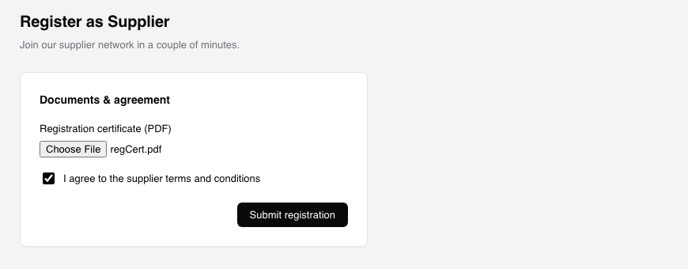
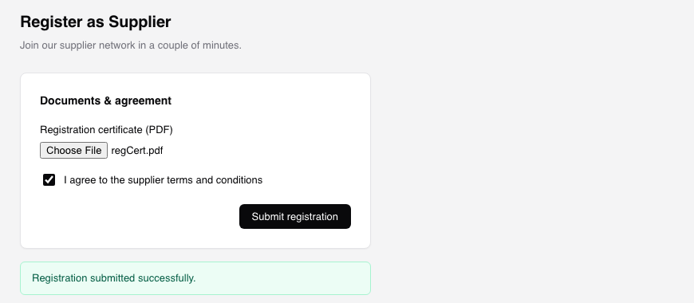

# formpilot


**Your AI coding agent fills out and submits web forms for testing — by driving a real browser.**

Ask Claude Code or Codex to test a form. formpilot reads the fields, generates
realistic data, fills it in, uploads files, walks multi-step wizards, and
submits — no database access, no app code changes. The browser opens visibly
by default, so you watch it happen live instead of taking it on faith.

<table>
<tr>
<td><br/><sub>Filled with generated data</sub></td>
<td><br/><sub>Submitted and verified</sub></td>
</tr>
</table>

## 3 steps

**1. Clone**

```bash
git clone https://github.com/MazenBorong/formpilot.git && cd formpilot && npm run setup
```

Installs everything (including a Chromium browser), builds, and registers
formpilot as an MCP server with whichever of Claude Code / Codex is on your
machine. Safe to re-run anytime.

**2. Allow your host**

Open `formpilot.config.json` and add the host you're testing to
`allowedHosts`:

```json
{ "allowedHosts": ["myapp.test"] }
```

formpilot refuses to touch any host not on this list — no accidental runs
against production.

**3. Use it**

Open Claude Code or Codex and ask:

> "use formpilot to dry-run the signup form on myapp.test, show me the data, then submit it"

Watch the browser do it live, then check `./formpilot-runs/<timestamp>/` for
the screenshot and payload.

## How it works

Three MCP tools, used in order:

- **`inspect_form`** — loads the page, returns every field's name, type,
  constraints, and options as a schema.
- **`generate_test_data`** — turns that schema into realistic values (no
  browser involved), so you can review or override before anything touches
  the page.
- **`fill_and_submit`** — fills the form, uploads generated fixture files,
  walks multi-step wizards, and submits via the real submit button. Reports
  final URL, validation errors, console/network errors, and a screenshot.

A `formpilot fill <url>` CLI does all three in one shot for humans.

## Safe by default

- Refuses to touch any host not in `allowedHosts` — production is never one
  typo away.
- Headed (visible) by default — set `"headless": true` in
  `formpilot.config.json` for CI or quiet background runs.
- `dryRun: true` fills and screenshots but never clicks submit.
- Every run's payload and screenshot are saved to `./formpilot-runs/<timestamp>/`.

## More

- **Login-gated forms** — define named profiles (`loginUrl`, `fields`,
  `submit`) in `formpilot.config.json`; secrets are read from env vars
  (`$MY_VAR`), never stored or logged.
- **Manual setup / Codex config / piecemeal commands** — see
  [`scripts/`](scripts) and `package.json` for `npm run build`, `npm run
  claude`, `npm run codex`.
- **Tests** — `npm test` runs a full `fill_and_submit` pass against the
  bundled sample form in `test/fixtures/`.
- **Known limits** — regex `pattern` constraints aren't solved generically;
  no LLM-assisted filling yet (deterministic rules + faker).

## License

[MIT](LICENSE)
